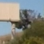
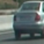
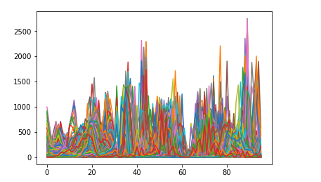
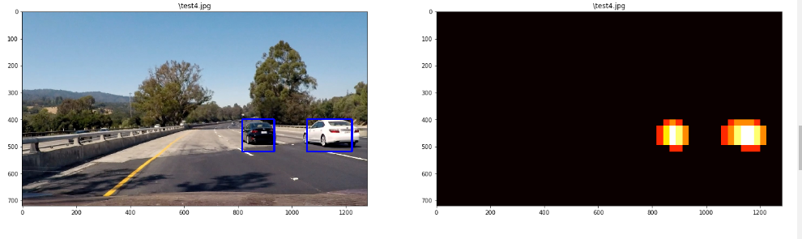

**Vehicle Detection Project**

The goals / steps of this project are the following:

* Perform a Histogram of Oriented Gradients (HOG) feature extraction on a labeled training set of images and train a classifier Linear SVM classifier
* Optionally, you can also apply a color transform and append binned color features, as well as histograms of color, to your HOG feature vector. 
* Note: for those first two steps don't forget to normalize your features and randomize a selection for training and testing.
* Implement a sliding-window technique and use your trained classifier to search for vehicles in images.
* Run your pipeline on a video stream (start with the test_video.mp4 and later implement on full project_video.mp4) and create a heat map of recurring detections frame by frame to reject outliers and follow detected vehicles.
* Estimate a bounding box for vehicles detected.


## [Rubric](https://review.udacity.com/#!/rubrics/513/view) Points
### Here I will consider the rubric points individually and describe how I addressed each point in my implementation.  

## Writeup / README

#### 1. Provide a Writeup / README that includes all the rubric points and how you addressed each one.  You can submit your writeup as markdown or pdf.  [Here](https://github.com/udacity/CarND-Vehicle-Detection/blob/master/writeup_template.md) is a template writeup for this project you can use as a guide and a starting point.  

You're reading it!

### Histogram of Oriented Gradients (HOG)

#### 1. Explain how (and identify where in your code) you extracted HOG features from the training images.

In order to extract all of the HOG features for the images, i used the pipeline contained in the 'Train the model' section of the VehicleDetection IPython notebook.  This function relies on several other function to complete it's work:
* get_hog_features(): Returns all the HOG features from a single image.
* bin_spatial(): Returns the binned spatial features of a single image.  For this exercise I used a bin sixe of (32,32)
* color_hist(): Returns a color histogram from a single image.  For this I used all 3 channels for the image, and then concatenated them into a single feature vector.  It is important to note I used YCrCb as the format for these images.

I started by reading in all the `vehicle` and `non-vehicle` images.  Here is an example of one of each of the `vehicle` and `non-vehicle` classes:





#### 2. Explain how you settled on your final choice of HOG parameters.

Determining the proper parameters for the functions, such as bin size, orientations, and even color conversion was a lot of trial and error.  I started using base parameters I pulled from the various lessons, as that seemed a logical place to start.  From there I fine tuned them in an ordered and documented approach where I annotated the change as well as a result.  I computed each of the functions above independently until I had a result I was happy with.  I then began combining the functions together, such as color_hist and bin_spatial.  I ended up finding a set of parameters which performed well under any condition:
* orient = 9
* pix_per_cell = 8
* cell_per_block = 2
* hog_channel = "ALL" # Can be 0, 1, 2, or "ALL"
* spatial_size = (32,32)
* hist_bins=32

#### 3. Describe how (and identify where in your code) you trained a classifier using your selected HOG features (and color features if you used them).

For this project I used a Linear SVC provided by SKLearn.  I would like to explore using a CNN on this and see if I can get better results. In order to train the classifier I used HOG features, color histograms, and binned color features. This code is contained in the 'Train The Model' section of the IPython notebook. 

I used all the images provided to us in the 'vehicles' and 'non-vehicles' training set.  The break down of images into directories was pretty fragmented for the vehicles.  I ended up renaming all of the files and creating directories of  'vehicles' and 'non-vehicles'.  

Using the parameters from above, I was able to create a model with 99.5% accuracy.  Once I achieved this accuracy, I felt the classifier was strong enough to start working on some images.  In order to avoid training the classifier each time I wanted to test I ended up making a pickle file where I stored the classifier as well as all the variables I used when training.  I felt it was important to save the variables used to train as it would lesses the risk of misentering a variable later on, as I really look at this assignment as 2 projects:
1. Build and train a classifier
2. Detect and track vehicles.

I also felt by saving the trained classifier it would be easier to integrate this project into others such as the advanced lane detection project. 

### Sliding Window Search

#### 1. Describe how (and identify where in your code) you implemented a sliding window search.  How did you decide what scales to search and how much to overlap windows?

For the sliding window search, I chose to calculate the HOG features of the image once, and then subsample a section of the image.  I used the bottom portion of the image, starting on the y axis at 400 since this is slightly above the road on the horizon.  I searched the image at a scale of 1.5 as this seemed to produce the most accurate results.  I also overlapped each window by 50%.  


#### 2. Show some examples of test images to demonstrate how your pipeline is working.  What did you do to optimize the performance of your classifier?

Ultimately I searched using YCrCb 3-channel HOG features plus spatially binned color and histograms of color in the feature vector, which provided a nice result.  Here are some example images:


<p style="text-align: center;">Color Histogram of an image:</p>



<p style="text-align: center;">Heat Map of same image:</p>




### Video Implementation

#### 1. Provide a link to your final video output.  Your pipeline should perform reasonably well on the entire project video (somewhat wobbly or unstable bounding boxes are ok as long as you are identifying the vehicles most of the time with minimal false positives.)
Here's a [link to my video result](./OutputVideos/project_video_out.mp4)

#### 2. Describe how (and identify where in your code) you implemented some kind of filter for false positives and some method for combining overlapping bounding boxes.

I recorded the positions of positive detections in each frame of the video.  From the positive detections I created a heatmap and then thresholded that map to identify vehicle positions.  I then used `scipy.ndimage.measurements.label()` to identify individual blobs in the heatmap.  I then assumed each blob corresponded to a vehicle.  I constructed bounding boxes to cover the area of each blob detected.  

These thresholded heatmaps allowed me to filter out false positives and overlapping boxes.  I then found the boxes jumped around quite a bit so I smoothed and averaged the heatmap out over 10 frames. This allowed for a much smoother detection.


### Discussion

#### 1. Briefly discuss any problems / issues you faced in your implementation of this project.  Where will your pipeline likely fail?  What could you do to make it more robust?

Most of this project progressed fairly easy.  I did struggle with ensuring I added my features in the right order in the model and the video pipelines.  This caused me to recieve several errors, which I was able to work through with the help of my mentor.  I also had issues where I would tweak a parameter in the model, and then not adjust the corresponding parameter in the pipeline.  This is what led me to saving my adjustable parameters in a pickle file.

Once I was successfully detecting the images, I then had problems with the boxes bouncing all over the cars.  I tried several different approaches, and finally setteled on using the collections.dque (again at the suggestion of my outstanding mentor Mate!).  I set the queue length for 20, as I figured this was about 2/3rd of a frame at 30 fps.  This allowed me to have a much smoother video result.

  I am hoping to improve this project over time as I get more familier with python and the libraries we are using.  I also ran this classifier on the challenge video. I ran it on the harder challenge video and it failed miserably.  I think by tweaking the heat threshold I could remove many of the false positives from that video.  The results were OK, many of the vehicles were detected, but again, I hope to improve this in the future.


```python

```
